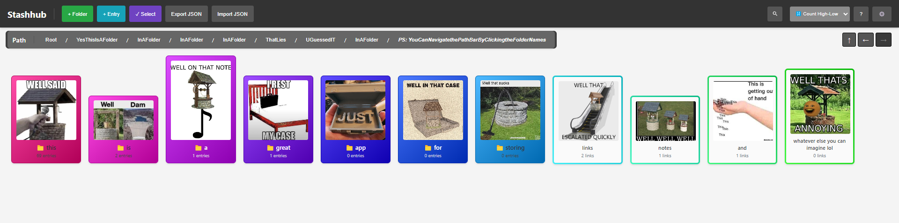

# Stashhub
A lightweight Flask web app for visually organizing folders and entries with cover images, links, and notes, persisted in plain JSON.



## Table of Contents
- [Overview](#overview)
- [Features](#features)
- [Getting Started](#getting-started)
  - [Prerequisites](#prerequisites)
  - [Installation](#installation)
  - [Uninstall](#uninstall)
- [Usage](#usage)
- [License](#license)

## Overview
Stashhub is a compact, local-first Flask application for visually arranging folders and saved entries. Each entry can include a cover image, link, and freeform notes and is stored in a plain JSON file so data remains portable and easy to back up. The user interface emphasizes quick visual navigation and lightweight bookmarking for personal collections.

## Features
- Create and organize folders and entries with drag-and-drop style UI.
- Cover images per entry for visual identification.
- Attach links and free-text notes to any entry.
- All data persisted in human-readable JSON files.
- Local-first operation. No external DB required.
- Simple import/export and backup via the JSON files.

## Getting Started

### Prerequisites
- Python 3.8 or newer installed.
- pip available for installing Python packages.

### Installation
1. Clone the repository (or alternatively head to the Releases section and download the latest zip):

```bash
git clone <repo-url>
cd <repo-directory>
```
2. Start the app. You can run the provided helper scripts or run the main module directly:

```bash
# Linux / macOS
chmod +x ./run.sh
./run.sh
```

```bash
# Windows
run.bat
```

3. Open the app in your browser at:

```
http://127.0.0.1:8780/
```

Note: the app does not automatically navigate your browser. You must manually open the URL above.

### Uninstall
To completely remove the app, delete the repository folder. No files are stored outside of it.

If you only want to remove user data, delete the JSON data files created by the app. By default these are located in:

```bash
./Files/
```

---

## Contribution Guidelines

Your contributions are welcome!

[Conventional Commits](https://www.conventionalcommits.org/)


## Contact

* **Maintainer**: Ventexx ([enquiry.kimventex@outlook.com](mailto:enquiry.kimventex@outlook.com))

# License

Stashhub © 2025 by Ventexx is licensed under CC BY-NC 4.0. To view a copy of this license, visit https://creativecommons.org/licenses/by-nc/4.0/
